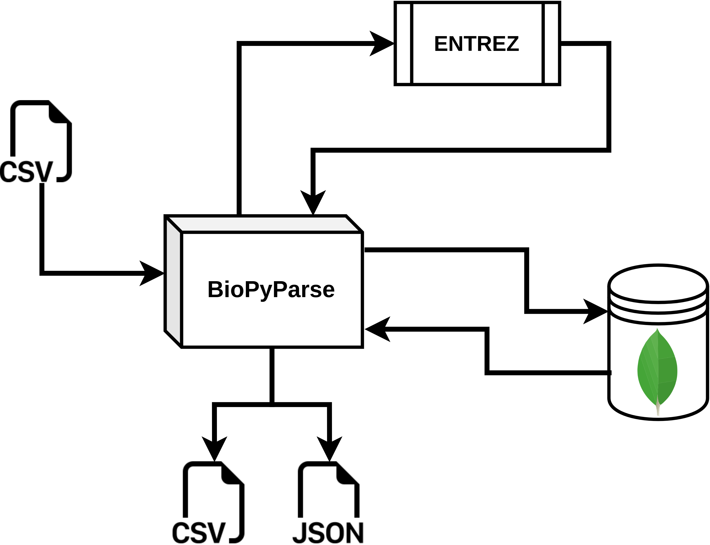

# BioPyParse


[](https://pypi.org/project/pip/)


[Università La Sapienza Roma](https://www.uniroma1.it/en), [Dipartimento di Informatica](https://www.studiareinformatica.uniroma1.it/)


### Credits

[`federico-rosatelli`](https://github.com/federico-rosatelli) [`Mat`](https://github.com/AxnNxs) [`Loriv3`](https://github.com/Loriv3) [`Samsey`](https://github.com/Samseys) [`Calli`](https://github.com/BboyCaligola)


# BioPyParse Module Description

Biopyparse is a simple module used to retrive data from [NCBI](https://www.ncbi.nlm.nih.gov/) and save it to a mongo-db database.

This program enable you to manage a large dataset of data accessible from other technologies and libraries. For faster data retrieval we recommend you to add you [NCBI login Email](https://account.ncbi.nlm.nih.gov/) with your [API Key](https://www.ncbi.nlm.nih.gov/account/settings/).


# Database Description

Data Collections (fundamental data):

- `nucleotide_data`       contains all microalgae data that can be found on NCBI under Nucleotide;
- `taxonomy_data`         contains all microalgae data that can be found on NCBI under Taxonomy;
- `protein_data`          contains all microalgae data that can be found on NCBI under Protein;

Auxiliary collections (assembled data):
  
- `table_basic`           contains basic data, for performance reasons, when doing search queries;
- `table_complete`        contains all heavy data such as features table in nucleotides and proteins;
- `taxonomy_tree`         contains all back-Lineage data for all species on a tree-shape object, it is generated by taxonomy_data;


## Structures examples


### nucleotide_data

```json
{
	"GBSeqAccessionVersion": "string",
	"GBSeqComment"         : "string",
	"GBSeqCreateDate"      : "string",
	"GBSeqDefinition"      : "string",
	"GBSeqDivision"        : "string",
	"GBSeqFeatureTable"    : [
        {
            "GBFeatureIntervals": {
                "GBIntervalAccession": "string",
                "GBIntervalFrom"     : "string",
                "GBIntervalTo"       : "string"
            },
            "GBFeatureKey"     : "string",
            "GBFeatureLocation": "string",
            "GBFeatureQuals": [
                {
                    "GBQualifierName" : "string",
                    "GBQualifierValue": "string"
                }
            ],
            "GBFeaturePartial3": "string",
            "GBFeaturePartial5": "string"
        }
    ],
	"GBSeqLength"          : "string",
	"GBSeqLocus"           : "string",
	"GBSeqMoltype"         : "string",
	"GBSeqOrganism"        : "string",
	"GBSeqOtherSeqids"     : ["string"],
	"GBSeqPrimaryAccession": "string",
	"GBSeqReferences"      : [
        {
            "GBReferenceAuthors"  : ["string"],
            "GBReferenceJournal"  : "string",
            "GBReferencePosition" : "string",
            "GBReferenceReference": "string",
            "GBReferenceTitle"    : "string"
        }
    ],
	"GBSeqSource"      : "string",
	"GBSeqStrandedness": "string",
	"GBSeqTaxonomy"    : "string",
	"GBSeqTopology"    : "string",
	"GBSeqUpdateDate"  : "string",
}
```

### table_complete


```json
{
	"ScientificName": "string",
	"TaxId"         : "string",
	"Nucleotides"   : [ nucleotide_data_struct ],
	"Proteins"      : [ protein_data_struct ],
	"Products"      : [
        {
            "ProductName" "string",
            "QtyProduct"  "string"
        }
    ],
	"Country": [
        {
            "CountryName" "string"
        }
    ]
}
```

# Module Structure



- The input CSV file is optional and parsed by the findSpeciesFromFile function

- The module is connected by pymongo library to a MongoDb Database. The user can execute various commands to import or get data from the database

- Entrez is used to get data from ncbi. Other auxiliary functions will be used to parse this data

- The output files (csv/json) have been implemented for the development of the Vulgaris platform. Methods for creating them could be implemented and built based on the actual module structure.

# Tester & Code Example

There is a testing file to manage and verify that all methods of the module work correctly.
The tester can be found at `./tests/tester.py` <br />
To execute it:
```code
python3 tests/tester.py
```
## Methods examples

The module consists of a class, called biopyparse, and a function. The class is initialized without access to the database which must be set with the method: 
```python
def newDatabase(self,databaseName:str,clientIp:str="localhost",clientPort:int=27017)
```

Assuming you have downloaded the desired taxonomic data, the method:
```python
def generateTaxonomyTree(self,collectionName:str|None = "taxonomy_tree",taxonomyCollection:str|None = "taxonomy_data")
```
will create a taxonomic tree structured like this
```json
[
    {
        "ScientificName": "ExampleScientificName",
        "TaxId": "ExampleTaxId",
        "Rank": "ExampleRank",
        "SubClasses": [
            {
                "ScientificName": "SubExampleScientificName",
                "TaxId": "SubExampleTaxId"
            },
            ...
        ]
    },
    ...
]
```
and it'll import it into the database with the collection name as `collectionName`.

The following code is an example of using the module

```python3
from Bioparse import BioPyParse

bio = BioPyParse(verbose=True)

bio.newDatabase("BiologyTest")

organismList = ["Chlorella", "Scenedesmus"]

taxIds = bio.importTaxonFromList(organismList,collectionName="taxonomy")

bio.generateTaxonomyTree(collectionName="taxon_tree",taxonomyCollection="taxonomy")
```


# Modules used

Biopython:            "https://biopython.org/wiki/Documentation"

Pymongo:              "https://pymongo.readthedocs.io/en/stable/"
